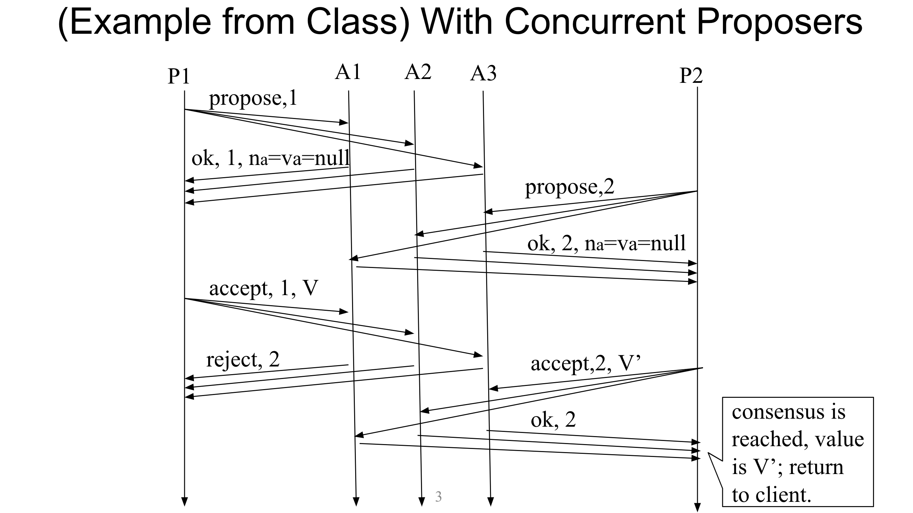
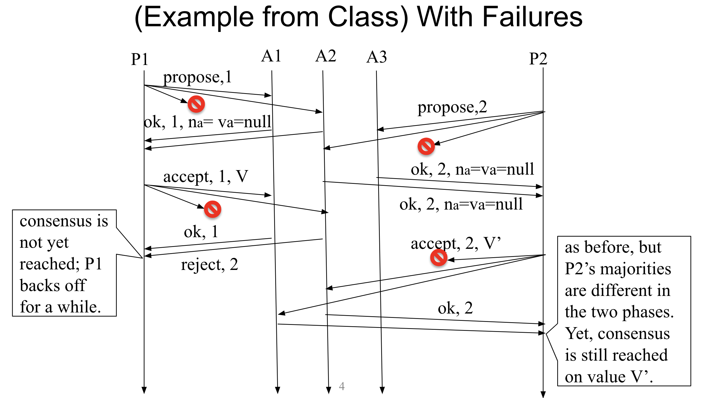
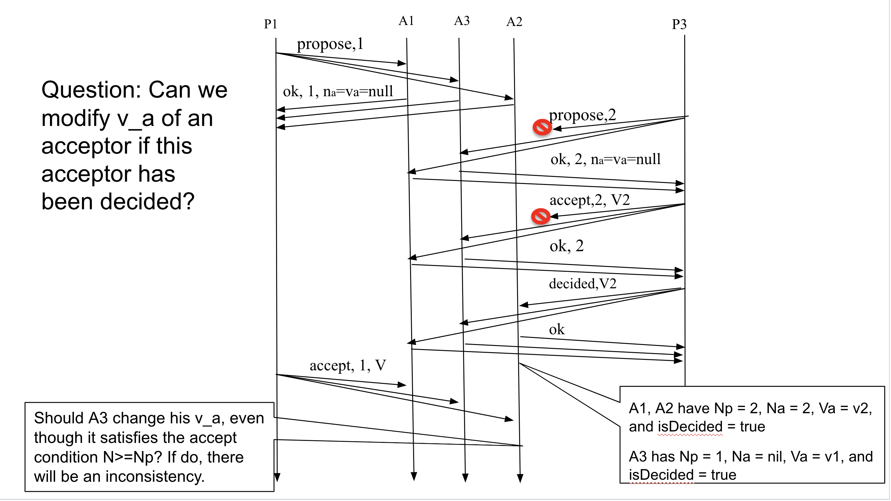

# Paxos Model Checker - Distributed Systems Verification Project

## Overview

The Paxos Model Checker project represents a comprehensive effort to implement and verify the Paxos algorithm, a fundamental protocol in distributed systems for achieving consensus. This project is developed in Go and focuses on model checking, a method used to systematically explore all possible states of a distributed system to ensure correctness and reliability, even in rare and challenging scenarios.

### Project Description

- **Model Checking in Distributed Systems**: Implemented a model checker from scratch to simulate and test distributed systems. This approach goes beyond traditional fuzz testing by exploring all possible system states.
- **Paxos Protocol Implementation**: Developed an implementation of the Paxos consensus protocol, a core algorithm in distributed computing. Ensured adherence to the protocol's specifications and behaviors.

### Features

- **State Machine Abstraction**: The entire system (nodes + network) is abstracted as a state machine. This includes handling events like message arrivals and timer triggers. Provides an interface for specifying system's state machine, defining test scenarios, and running BFS algorithm to explore all possible events and interleavings up to final states while checking invariants.
- **Event-Driven Architecture**: The system evolves by processing events such as message delivery and timer activations, leading to new system states.
- **Comprehensive Testing**: Utilized Breadth First Search (BFS) to walk through all states, validating the correctness of the Paxos implementation under various scenarios. 

### Challenges and Solutions

- **Handling Network Abstractions**: Modeling network behaviors, such as message drops and delays, was challenging. A detailed abstraction of on-the-fly messages was implemented to simulate real network conditions.
- **State Explosion**: The challenge of state explosion was addressed by carefully designing test scenarios and using efficient state representation and search strategies.
- **Ensuring Immutability**: Maintaining immutability in nodes and messages was crucial for accurate state representation. This was achieved by creating copies of nodes and messages before modifications.

### Paxos Implementation

- **Node and Timer Interfaces**: Implemented interfaces for nodes and timers, forming the basis of the state machine.
- **Message Handling**: Developed a sophisticated message handling system to simulate various network conditions and node behaviors.
- **Proposer and Acceptor Logic**: Carefully implemented the logic for proposers and acceptors in the Paxos protocol, ensuring correct state transitions and consensus achievement.

### Conclusion

This project showcases a practical implementation of model checking in verifying the Paxos protocol, addressing complex challenges inherent in distributed systems. It serves as a valuable reference for understanding and verifying distributed consensus algorithms.

## Technologies

- **Language**: Go (version 1.19.1)
- **Testing Frameworks**: Utilized Go's built-in testing frameworks for comprehensive unit and integration tests.

## Debugging Certain Scenarios

## Debugging Certain Scenarios

### Strategy Overview

To address and debug edge-case scenarios in distributed systems like those encountered with the Paxos protocol, I have employed detailed sequence diagrams. These diagrams are instrumental in visualizing the interactions between different components of the system, specifically proposers and acceptors, and the potential race conditions that can arise.

### Diagram Development Process

1. **Identify the Scenario**: Start by identifying the specific edge-case or race condition that needs to be examined.

2. **Define the Participants**: List all the participants involved in the scenario. In Paxos, these are typically the proposers (P) and acceptors (A).

3. **Sequence of Events**: Outline the sequence of events that occur between the participants. This includes proposals, acceptances, rejections, and decisions.

4. **Time Axis Construction**: Create a time axis for the diagram, representing the chronological order of events.

5. **Message Exchanges**: Draw arrows to represent the messages exchanged between the participants. These messages include 'propose', 'accept', and 'decided'.

6. **Annotations**: Add annotations to describe the conditions and state changes at each step, such as `Np`, `Na`, `Va`, and `isDecided` statuses.

7. **Decision Points**: Clearly mark the decision points, where an acceptor decides on a value, and note the conditions under which these decisions are made.

8. **Edge-Case Identification**: Highlight the edge-case scenarios, such as where a proposer might receive an 'ok' message from an acceptor that has already decided, raising the question of whether the value `v_a` can be modified post-decision.

9. **Consistency Checks**: Ensure that the diagram reflects the consistency rules of the Paxos protocol, where once a value has been decided by the majority, no other value can be accepted.

10. **Iterative Refinement**: Continuously refine the diagram as new insights are gained or additional complexities are identified.

### Example Use-Cases
 
Concurrent Proposers


In this scenario, we analyze a system with two concurrent proposers, P1 and P2, interacting with a set of acceptors A1, A2, and A3. The objective is to understand how the system reaches consensus when multiple proposers are active simultaneously.

- **Scenario Flow**:
  - P1 starts the consensus process with `propose,1` but faces a rejection from A1 (`ok, 1, na=va=null` with a rejection mark), which simulates a message loss or a failure.
  - P1 then sends `accept, 1, V` to all acceptors.
  - P2 concurrently sends `propose,2`, and A1 and A2 respond with `ok, 2, na=va=null`.
  - A1 accepts P1's proposal (`accept, 1, V`), while A2 accepts P2's proposal (`accept, 2, V'`).
  - A2's acceptance of P2's proposal has a rejection mark, indicating a failure in the acceptance process.
  - P1 backs off for a while as it cannot reach consensus due to message rejections.
  - Despite the initial failures and rejections, P2 continues the process and eventually reaches consensus on value V', which differs from P1's initial proposal.


Concurrent Proposers with Failures


This scenario demonstrates the system's behavior in the presence of failures, such as message loss or rejection.

- **Scenario Flow**:
  - P1 starts the consensus process with `propose,1` but faces a rejection from A1 (`ok, 1, na=va=null` with a rejection mark), which simulates a message loss or a failure.
  - P1 then sends `accept, 1, V` to all acceptors.
  - P2 concurrently sends `propose,2`, and A1 and A2 respond with `ok, 2, na=va=null`.
  - A1 accepts P1's proposal (`accept, 1, V`), while A2 accepts P2's proposal (`accept, 2, V'`).
  - A2's acceptance of P2's proposal has a rejection mark, indicating a failure in the acceptance process.
  - P1 backs off for a while as it cannot reach consensus due to message rejections.
  - Despite the initial failures and rejections, P2 continues the process and eventually reaches consensus on value V', which differs from P1's initial proposal.


Sequential Proposers

In the diagram, the scenario explores the question of whether an acceptor can modify its accepted value `v_a` after it has already decided on a value. This particular case is crucial because it can lead to inconsistencies within the system if not handled correctly.

The scenario begins with proposer `P1` sending a proposal to acceptors `A1`, `A2`, and `A3`. `A1` and `A3` respond with 'ok', allowing `P1` to move forward. However, `P3` concurrently sends a proposal which is received by `A2`. The sequence shows `A2` and `A1` deciding on `P3`'s proposal, while `A3` is still on `P1`'s proposal due to message delays.

This edge-case analysis is vital in ensuring that our Paxos implementation adheres to the fundamental properties of the consensus protocol and handles all such conditions correctly. By visualizing these interactions, we can debug the system's behavior and confirm the reliability of our implementation even under the most unusual or rare circumstances.


## How to Run
To run all the tests, I have developed a bash script. Type the following in your terminal. Make sure your GOMODULE is configured properly.
```
$ ./check_tests.sh
```


